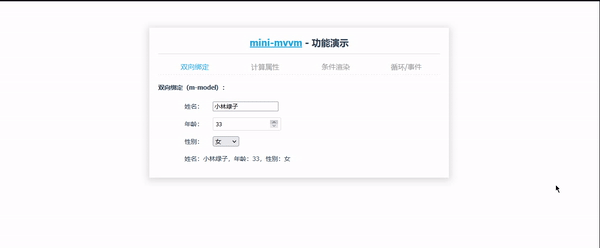

# mini-MVVM

#### 介绍
一个简单的mvvm模型

#### 简单原理
1. MVVM是Model-View-ViewModel的缩写。MVVM是一种设计思想。Model 层代表数据模型，也可以在Model中定义数据修改和操作的业务逻辑；View 代表UI 组件，它负责将数据模型转化成UI 展现出来，ViewModel 是一个同步View 和 Model的对象。

2. 在MVVM架构下，View 和 Model 之间并没有直接的联系，而是通过ViewModel进行交互，Model 和 ViewModel 之间的交互是双向的， 因此View 数据的变化会同步到Model中，而Model 数据的变化也会立即反应到View 上。

3. ViewModel 通过双向数据绑定把 View 层和 Model 层连接了起来，而View 和 Model 之间的同步工作完全是自动的，无需人为干涉，因此开发者只需关注业务逻辑，不需要手动操作DOM, 不需要关注数据状态的同步问题，复杂的数据状态维护完全由 MVVM 来统一管理。


#### 安装教程

1. 将此库下载之后在此目录下 安装包

   ```
   npm i
   ```
   
2. 在再此目录

   ```
   npm start
   ```

#### 演示[Demo](https://tang186.github.io/)



#### 具体逻辑

1. 先将数据与函数代理到对象（MVVM)上面

2. compiler对象 先把原始的dom节点转化为文档碎片 这样可以提高性能

3. 开始编译模板判断元素的种类如果是节点或者是文本

   1. 元素节点需要解析指令,需要递归调用compile

   2. 文本就直接渲染

4. 元素节点判断属性 text或者model或者其他的

   元素节点需要递归处理

5. 文本节点进行替换

6. 再就是数据劫持将数据放入一个对象中

   1. 遍历对象完成数据劫持
   2. 给每一个数据加，用defineProperty函数 修改get和set
   3. 在第一次编译的时候,Wtacher中构造函数会有读取这个数据的值并且把Dep的target设置为这个Watcher，会有第一次gets数据这个时候用Dep对象把这个数据的Watcher添加到订阅数组中（发布订阅模式）
   4. 需要递归处理加入的值
   5. 还需要对数组整体进行劫持重写数组的\_\_proto\_\_

7. 还有数据观察 新建一个Watcher对象

   1. 将数据 作用域和回调函数传入
   2. 有一个update函数在每一次更新数据的时候会调用这个函数 这个函数一开始调用一次 将数据渲染到页面
   3. 这个函数在获取新数据的时候会在数据劫持中添加订阅
   4. 在Watcher中把每个文本节点{{}}都储存了原本的内容比如 aa{{msg}}aaa 这个内容一直被储存在Watcher中然后每次修改 msg 这个数据的内容就重新获取一下这个文本节点，所有需要一个computeExpression函数
   5. 还有对每一个数组进行watch在数组变化的时候进行notify()函数

8. 最后有一个dep发布订阅的类

   1.  用一个数组把所有需要同步的节点或者文本都加入订阅
   2.  每一次更新数据都发布通知 在数据劫持的set中加入这个函数的调用


